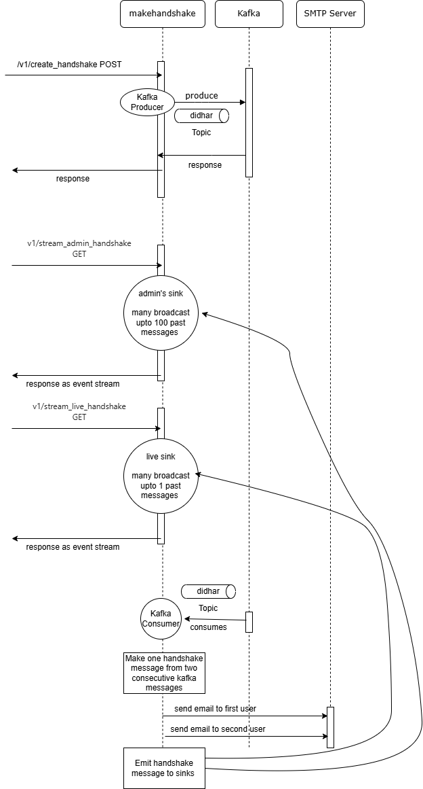

## One Click Run the Application
```
docker-compose up -d
```

## To Custom run your application

#### Step 1 (SMTP Server Settings)
Change `application.properties`
Modify them with your service gmail address and app password
```
spring.mail.username=YOUR_GMAIL
spring.mail.password=YOUR_PASSWORD
```
#### Step 2
Build the Spring Boot App with Java 17+
```
cd makehandshake/makehandshake
mvn clean compile install -DskipTests
```
#### Step 3
```
cd ..
cd ..
docker-compose -f my-docker-compose.yml up
```

## Run Frontend

```
& "C:\Program Files\Google\Chrome\Application\chrome.exe" --disable-web-security --user-data-dir="C:\chrome_dev"
```

## Design & Sequence Diagram
